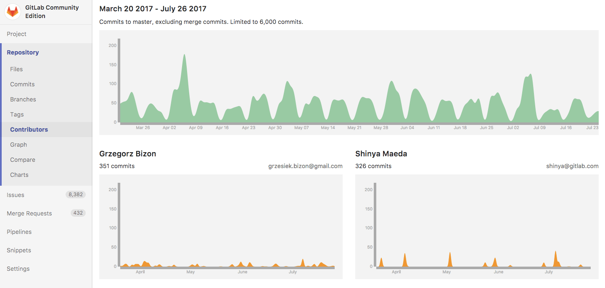
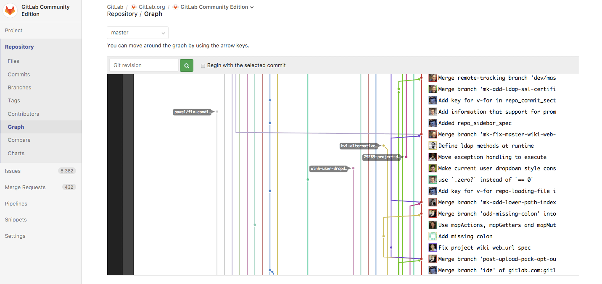
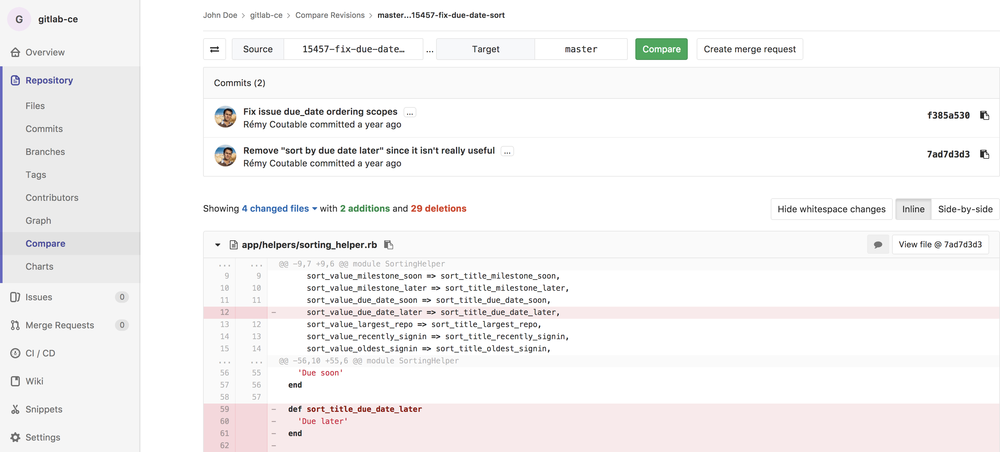

# Repository

A [repository](https://git-scm.com/book/en/v2/Git-Basics-Getting-a-Git-Repository)
is what you use to store your codebase in GitLab and change it with version control.
A repository is part of a [project](../index.md), which has a lot of other features.

## Create a repository

To create a new repository, all you need to do is
[create a new project](../../../gitlab-basics/create-project.md).

Once you create a new project, you can add new files via UI
(read the section below) or via command line.
To add files from the command line, follow the instructions that will
be presented on the screen when you create a new project, or read
through them in the [command line basics](../../../gitlab-basics/start-using-git.md)
documentation.

> **Important:**
For security reasons, when using the command line, we strongly recommend
you to [connect with GitLab via SSH](../../../ssh/README.md).

## Files

### Create and edit files

Host your codebase in GitLab repositories by pushing your files to GitLab.
You can either use the user interface (UI), or connect your local computer
with GitLab [through the command line](../../../gitlab-basics/command-line-commands.md#start-working-on-your-project).

To configure [GitLab CI/CD](../../../ci/README.md) to build, test, and deploy
you code, add a file called [.`gitlab-ci.yml`](../../../ci/quick_start/README.md)
to your repository's root.

**From the user interface:**

GitLab's UI allows you to perform lots of Git commands without having to
touch the command line. Even if you use the command line regularly, sometimes
it's easier to do so [via GitLab UI](web_editor.md):

- [Create a file](web_editor.md#create-a-file)
- [Upload a file](web_editor.md#upload-a-file)
- [File templates](web_editor.md#template-dropdowns)
- [Create a directory](web_editor.md#create-a-directory)
- [Start a merge request](web_editor.md#tips)

**From the command line:**

To get started with the command line, please read through the
[command line basics documentation](../../../gitlab-basics/command-line-commands.md).

### Find files

Use GitLab's [file finder](../../../workflow/file_finder.md) to search for files in a repository.

## Branches

When you submit changes in a new [branch](branches/index.md), you create a new version
of that project's file tree. Your branch contains all the changes
you are presenting, which are detected by Git line by line.

To continue your workflow, once you pushed your changes to a new branch,
you can create a [merge request](../merge_requests/index.md), perform
inline code review, and [discuss](../../discussions/index.md)
your implementation with your team.
You can live preview changes submitted to a new branch with
[Review Apps](../../../ci/review_apps/index.md).

With [GitLab Enterprise Edition](https://about.gitlab.com/gitlab-ee/)
subscriptions, you can also request
[approval](https://docs.gitlab.com/ee/user/project/merge_requests/merge_request_approvals.html#merge-request-approvals) from your managers.

To create, delete, and [branches](branches/index.md) via GitLab's UI:

- [Default branches](branches/index.md#default-branch)
- [Create a branch](web_editor.md#create-a-new-branch)
- [Protected branches](../protected_branches.md#protected-branches)
- [Delete merged branches](branches/index.md#delete-merged-branches)

Alternatively, you can use the
[command line](../../../gitlab-basics/start-using-git.md#create-a-branch).

To learn more about branching strategies read through the
[GitLab Flow](../../../university/training/gitlab_flow.md) documentation.

## Commits

When you [commit your changes](https://git-scm.com/book/en/v2/Git-Basics-Recording-Changes-to-the-Repository),
you are introducing those changes to your branch.
Via command line, you can commit multiple times before pushing.

- **Commit message:**
A commit message is important to identity what is being changed and,
more importantly, why. In GitLab, you can add keywords to the commit
message that will perform one of the actions below:
  - **Trigger a GitLab CI/CD pipeline:**
  If you have your project configured with [GitLab CI/CD](../../../ci/README.md),
  you will trigger a pipeline per push, not per commit.
  - **Skip pipelines:**
  You can add to you commit message the keyword
  [`[ci skip]`](../../../ci/yaml/README.html#skipping-jobs)
  and GitLab CI will skip that pipeline.
  - **Cross-link issues and merge requests:**
  [Cross-linking](../issues/crosslinking_issues.md#from-commit-messages)
  is great to keep track of what's is somehow related in your workflow.
  If you mention an issue or a merge request in a commit message, they will be shown
  on their respective thread.
- **Cherry-pick a commit:**
In GitLab, you can
[cherry-pick a commit](../merge_requests/cherry_pick_changes.md#cherry-picking-a-commit)
right from the UI.
- **Revert a commit:**
Easily [revert a commit](../merge_requests/revert_changes.md#reverting-a-commit)
from the UI to a selected branch.
- **Sign a commit:**
Use GPG to [sign your commits](gpg_signed_commits/index.md).

## Repository size

In GitLab.com, your repository size limit it 10GB. For other instances,
the repository size is limited by your system administrators.

You can also [reduce a repository size using Git](reducing_the_repo_size_using_git.md).

## Contributors

All the contributors to your codebase are displayed under your project's **Settings > Contributors**.

They are ordered from the collaborator with the greatest number
of commits to the fewest, and displayed on a nice graph:

## Repository graph

The repository graph displays visually the Git flow strategy used in that repository:

Find it under your project's **Repository > Graph**.

## Compare

Select branches to compare and view the changes inline:

Find it under your project's **Repository > Compare**.

## Locked files (EEP)

Lock your files to prevent any conflicting changes.

[File Locking](https://docs.gitlab.com/ee/user/project/file_lock.html) is available only in
[GitLab Enterprise Edition Premium](https://about.gitlab.com/gitlab-ee/).

## Repository's API

You can access your repos via [repository API](../../../api/repositories.md).
